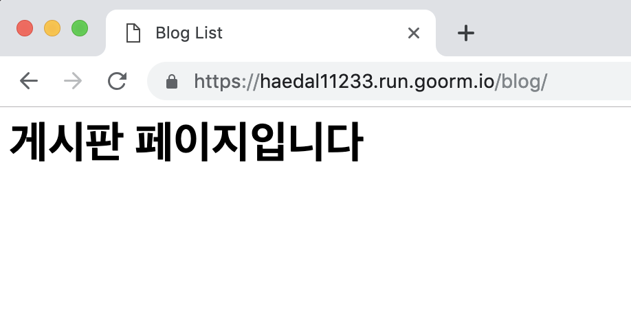
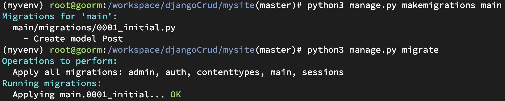

# 해달 부트캠프 3주차
# 게시판 만들기

### `Django`의 구조
`Django`는 `MVC`모델을 `MTV`라고 부릅니다  
`MVC` 구조가 학계의 정설이지만 `Django`에선 `MTV`라고 이야기합니다.  
자세한 내용은 아래의 문서를 참고하시면 됩니다.  

[Django의 MTV 패턴](https://jayzzz.tistory.com/68)  
[Django의 개발 방식 - MTV 패턴](https://revidream.tistory.com/16)  
[MVC 패턴이란?](https://medium.com/@jang.wangsu/%EB%94%94%EC%9E%90%EC%9D%B8%ED%8C%A8%ED%84%B4-mvc-%ED%8C%A8%ED%84%B4%EC%9D%B4%EB%9E%80-1d74fac6e256)  
[위키피디아 - MVC 패턴](https://ko.wikipedia.org/wiki/%EB%AA%A8%EB%8D%B8-%EB%B7%B0-%EC%BB%A8%ED%8A%B8%EB%A1%A4%EB%9F%AC)  


#### `MTV`
장고의 `MTV`패턴은 자바 웹 프로그래밍의 `MVC`패턴과 거의 동일한 개념으로,   
웹 프로그래밍 영역을 3가지 개념으로 나눠서 개발하는 방식입니다.   


`MTV`는 3가지 영역으로 구분해 개발을 정의합니다

* DB 테이블을 정의하는 `Model`
* 사용자가 보는 화면을 정의하는 `Template`
* 에플리케이션의 제어 흐름 및 처리 로직을 정의하는 `View`  

이렇게 3가지로 나눠 개발하면 `Model`,`Template`,`View` 모듈 간에 독립성을 유지할 수 있고  
디자이너, 개발자, DB 설계자 간에 협업도 쉬워집니다

#### `CRUD`
`CRUD`는 대부분의 컴퓨터 소프트웨거 가지는 기본적인 데이터 처리 기능인  
Create(생성), Read(읽기), Update(갱신), Delete(삭제)를 묶어서 일컫는 말입니다.  


|  이름  | 조작 |   SQL  |
|:------:|:----:|:------:|
| Create | 생성 | INSERT |
|  Read  | 읽기 | SELECT |
| Update | 갱신 | UPDATE |
| Delete | 삭제 | DELETE |


## 목록 페이지 만들자

`mysite/djangobootcamp/urls.py`
```python
from django.contrib import admin
from django.urls import path
# index는 대문, blog는 게시판
from main.views import index, blog

urlpatterns = [
    path('admin/', admin.site.urls),
    # 웹사이트의 첫화면은 index 페이지이다
    path('', index),
    # URL:80/blog에 접속하면 blog 페이지
    path('blog/', blog),
]
```

`mysite/main/views.py`
```python
from django.shortcuts import render

# index.html 페이지를 부르는 index 함수
def index(request):
    return render(request, 'main/index.html')

# blog.html 페이지를 부르는 blog 함수
def blog(request):
    return render(request, 'main/blog.html')
```

`mysite/main/templates/main/blog.html`
```html
<html>
    <head>
        <title>Blog List</title>
    </head>
    <body>
        <h1>게시판 페이지입니다</h1>
    </body>
</html>
```
  
위의 페이지가 뜨면 성공!  


서버를 어떻게 실행했는지 기억나시나요?
### `웹서버 실행` 복습  

**프로젝트를 실행할때마다 반복해서 사용하는 명령어입니다**  
파이썬 가상환경 설정 
```console
root@goorm:/workspace/djangoBootcamp/mysite# source myvenv/bin/activate
```
이제 `django` 웹서버를 실행합시다   
구름 IDE를 사용하는 경우  
상단 메뉴바의 `프로젝트 -> 실행 URL과 포트`에서   
80번 포트를 설정 후 접속합니다
```console
(myvenv) root@goorm:/workspace/djangoBootcamp/mysite# python manage.py runserver 0:80 
```
## `Model` 만들기

게시판에서 각각의 게시글에 저장될 공간을 만듭니다.  
`Post` 게시글 마다 `postname`(제목), `contents`(내용)이 존재합니다.  
이를 파이썬으로 구현해봅니다.

`mysite/main/models.py`
```python
from django.db import models

# Create your models here.
# 게시글(Post)엔 제목(postname), 내용(contents)이 존재합니다
class Post(models.Model):
    postname = models.CharField(max_length=50)
    contents = models.TextField()
```
모델을 만들었고 이제 `django`의 db에 `migrate`해줍니다  
게시글마다 제목과 내용을 저장합니다  

##### `Ctrl + C`를 눌러 웹서버를 종료 후 `migration`

```console
(myvenv) root@goorm:/workspace/djangoBootcamp/mysite# python3 manage.py makemigrations main
```

```console
(myvenv) root@goorm:/workspace/djangoBootcamp/mysite# python3 manage.py migrate
```
아래와 같이 진행된다면 `migration` 완료!   
  


##### `Admin`에 권한
관리자(`admin`)이 게시글(`Post`)에 접근할 권한을 줍니다.  
게시글 게시, 삭제, 수정, 저장 등 여러 작업을 할 수 있게 합니다.  

`mysite/main/admin.py`
```python
from django.contrib import admin
# 게시글(Post) Model을 불러옵니다
from .models import Post

# Register your models here.
# 관리자(admin)가 게시글(Post)에 접근 가능
admin.site.register(Post)
```
